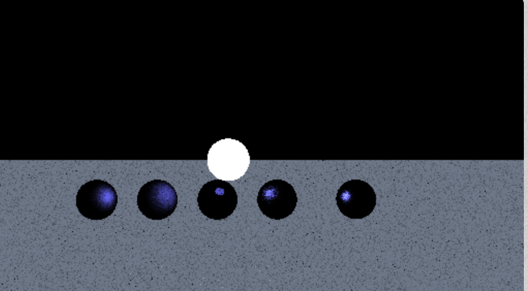
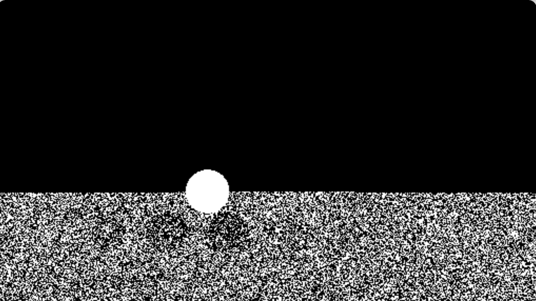
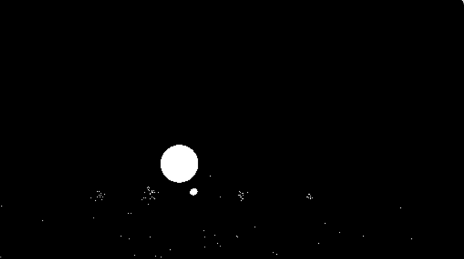
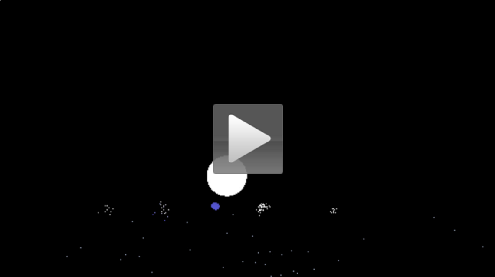
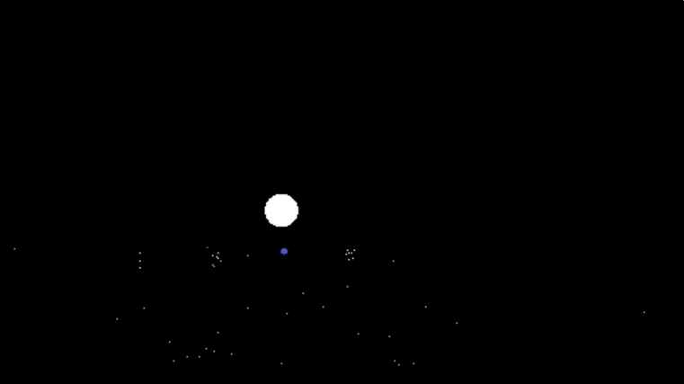
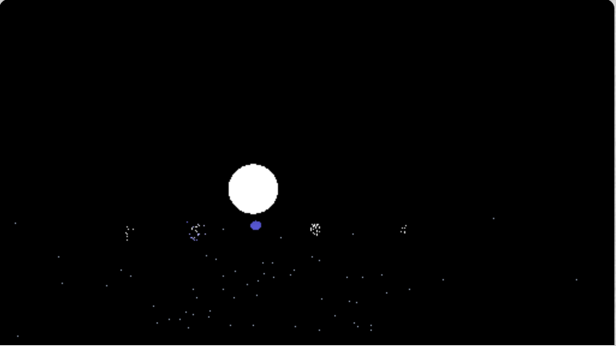
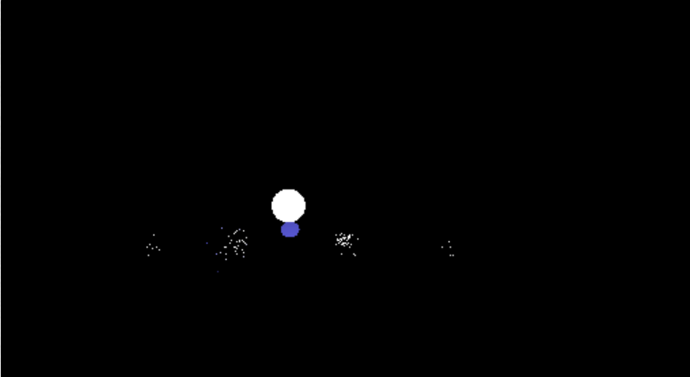

##WebGL Multiple Importance Sampling Path Tracer
###xinyue Zhu

Personal Website: https://seas.upenn.edu/~zhuxiny

address: http://zhuxinyue909.github.io/CIS-565-Final-WebGL-MIS/

Desbug Mode:https://www.shadertoy.com/view/Xs33WM

Technique:
1.multiple importance sampling
The Monte Carlo path tracer attempts to solve the light equations for all the visible points in the scene which ask people to recursively trace the ray until it hits the depth. However it may take a long time to converge to a usable image. To optimize the monte carlo path tracer poeple often use parallelization and multiple importance sampling methods. 

BRDF:A function that evaluates the energy emitted along ray given the intersection point of the scene and the direction from which the incoming light emits which is entirely dependent on the attributes of the material sampled at the intersection point. 

So In order to reduce the number of the samples that needed to produce the converged scene, we use multiple importace sampling method.

 the bebug secene of this method:

the material from left to right is blinn-microface(exponent=20),blinn-microface(exponent=10),perfect reflection,blinn-microface(exponent=50),blinn-microface(exponent=100)

which is posted on: https://www.shadertoy.com/view/Xs33WM

only contains the code relatively to the algorithm.

When sampling the light, the perfectly specular surface can only be seen when the light ray is perpendicular to surface, so it usually can not be seen when doing the light sample.

##Light Sampling: 

radiance:

when the radius of light is equals 0.3

when the radius of light is equals 0.5

when the radius of light is equals 1.0

Since the light sources are the most important elements in a rendered scene, for some subset of the rays ωi , select directions such that each ωi intersects a given light source at some point

##BRDF Sampling: 

when grenerating the new ray according to brdf of each material, it the new ray hit the light scource we can receive the radiance.
 

The radiance of brdf sampling:

###demo of brdf sampling with color:

<a href="https://www.youtube.com/watch?v=f-D2cRWvGIE&feature=youtu.be">

Sample ray directions that have a higher contribution to the color reflected along ωo, which is extremely useful in the case where the BRDF has a very narrow set of contributing rays like perfectly reflection case.So in this situation we can see the color of the object in the middle.

light radius=0.3:

light radius=0.5:

light radius=1.0:

When a BRDF is more specular, sampling only the light’s PDF makes it less likely that a large light will contribute to its color 

When a BRDF is more diffuse, sampling only the BRDF’s PDF makes it less likely that small lights will contribute to its color 

##power hueristic

the following image shows the pdf when sampling the brdf of each material.

<

2.Gamma correction

In CRT displays, the light intensity varies nonlinearly with the electron-gun voltage. Altering the input signal by gamma compression can cancel this nonlinearity, such that the output picture has the intended luminance. In this circumstance, use gammma correction to modify the color to make it look much prettier., When the GAMMA powers larger than 1 it makes the shadows darker, while Gamma is  smaller than 1 make dark regions lighter.

